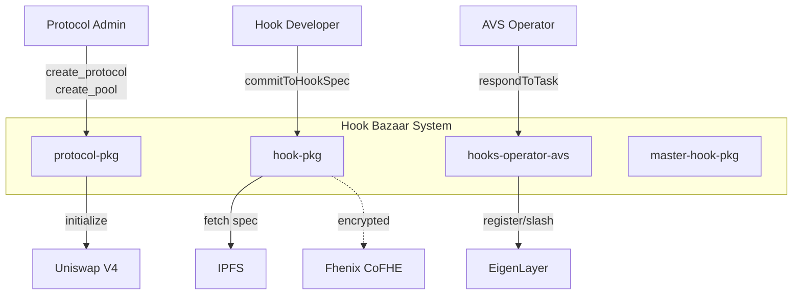

# Hook Bazaar Monorepo

<div align="center">

  
  
  
  
  
  
  
</div>

<p align="center">
  
</p>

## Table of Contents
- [Hook Bazaar Monorepo](#hook-bazaar-monorepo)
  - [Table of Contents](#table-of-contents)
  - [Problem Description](#problem-description)
  - [Demo](#demo)
  - [Solution Overview](#solution-overview)
  - [Architecture](#architecture)
  - [Setup](#setup)
  - [References](#references)

## Problem Description

Hook Bazaar solves **9 critical market failures** in the Uniswap v4 ecosystem:

1. **No marketplace for hooks** — Supply and demand exist but no mechanism connects them
2. **High barriers to entry** — Custom hooks cost $10k–$100k+ and take weeks/months to develop
3. **No developer incentives** — No monetization model or audience for hook developers
4. **Lack of standardization** — No way to objectively evaluate hook safety or correctness
5. **No hook composition** — Cannot safely combine multiple hooks despite v4 support
6. **No competition mechanism** — Best hooks don't naturally rise to the top
7. **No IP protection** — Public code prevents premium algorithm development
8. **No reputation system** — High adoption risk due to lack of trust signals
9. **Unsustainable economics** — No revenue model to support ecosystem growth

**Result**: Despite Uniswap v4's powerful hooks primitive, the ecosystem lacks the infrastructure to enable widespread adoption and sustainable development.

📖 **[Read the full Problem Description](docs/problem-description/PROBLEM_DESCRIPTION.md)** for detailed analysis of each market failure and how Hook Bazaar solves them.

---

## Demo

[](https://www.loom.com/share/8f8f5873702b4f6db3215892d824bba2)

[🎥 Watch the full demo on Loom](https://www.loom.com/share/8f8f5873702b4f6db3215892d824bba2)

---

## Solution Overview

Hook Bazaar is a **decentralized marketplace and infrastructure layer** for Uniswap v4 hooks that:

- **For Developers**: Direct monetization (flat/revenue-share/hybrid), professional reputation profiles, IP protection via FHE
- **For Protocols**: Instant deployment (minutes vs weeks), lower costs ($100s vs $10k+), pre-audited hooks, multi-hook composition
- **For Ecosystem**: Self-sustaining economic model, quality through competition, accelerated v4 adoption

### Core Features

- **Centralized Discovery Layer**: Connects hook supply with protocol demand
- **Ready-Made Hooks**: Reduces deployment time from weeks to minutes
- **Direct Monetization**: Fixed-price, revenue-share, or hybrid licensing models
- **Mathematical Specifications**: Hook Specification Format for objective behavior verification
- **MasterHook Diamond**: Safe multi-hook composition with selector-level routing

### Sponsor Integrations

#### Fhenix CoFHE — IP Protection Layer
Encrypts hook implementations on-chain to prevent bytecode decompilation and IP theft.
- Encrypted type wrappers (`EPoolKey`, `ESwapParams`, `EBalanceDelta`)
- Plaintext ↔ encrypted boundary at `CoFHEHook` contract
- Authorized verifier access for AVS sampling

[CoFHE Integration Spec](docs/hook-pkg/cofhe-haas/solutionSpec.md)

#### EigenLayer AVS — Attestation Layer
Provides cryptoeconomic guarantees for hook specification compliance via staked operators.
- `HookAttestationTaskManager`: Task creation and response handling
- `HookAttestationServiceManager`: Operator registration and slashing
- Challenge mechanism with 50% slash for false positives, 30% for false negatives
- Off-chain operator runtime for state sampling and compliance checking

[AVS Integration Spec](docs/hook-attestation-pkg/solutionSpec.md) | [Operator Runtime](operator/README.md)

### Value Delivery

- Hook developers: IP protection, monetization, reputation building
- Protocol designers: Instant deployment, lower costs, pre-verified hooks
- Ecosystem: Self-sustaining economics, quality improvement through competition

[Full Documentation](docs/README.md)

---

## Architecture

### System Context



**Goal**: Define environment boundary between Hook Bazaar and external systems (Uniswap V4, EigenLayer, IPFS, Fhenix).

[Full Context Diagram](docs/context-diagram.md)

### Package Structure

| Package | Purpose |
|---------|---------|
| `protocol-pkg` | Protocol lifecycle management for pool administration |
| `hooks-operator-avs` | EigenLayer AVS for hook specification attestation |
| `hook-pkg` | Hook development, marketplace, and IP protection |
| `master-hook-pkg` | Diamond-pattern multi-hook composition |
| `operator/` | Off-chain attestation task processing runtime |

[Package Documentation](docs/README.md#package-documentation)

### Bonded Hooks Comparison

| Dimension | Bonded Hooks | Hook Bazaar |
|-----------|-------------|-------------|
| Primary Focus | Low-code composition | IP-protected marketplace |
| Target User | Pool admins | Hook developers |
| Verification | Centralized AVS | Decentralized EigenLayer AVS |
| IP Model | Open source | Encrypted implementations |

**Key Differentiator**: Hook Bazaar provides mathematical specification verification with cryptoeconomic guarantees (slashing).

[Full Comparison](docs/hook-pkg/architecture/bonded-hooks-comparison.md) | [Operator EigenLayer Integration](operator/README.md)

---

## Setup

### Prerequisites

- Node.js v18+
- Foundry

### Build

```bash
npm install
forge install
forge build
```

### Test

```bash
# Run implemented tests only (excludes placeholder test files)
make test-implemented

# Run fork tests (requires ALCHEMY_API_KEY env var)
make test-fork

# Run all tests including placeholders
forge test
```

> **Note**: Some test files in `contracts/test/` are placeholders for future implementation (e.g., `hook-pkg/`, `hooks-operator-avs/`). Use `make test-implemented` for actual test coverage.

```bash
cd operator && npm test
```

### Attestation Simulation

```bash
# Terminal 1
anvil

# Terminal 2
cd operator
npm install
npx tsx integration/runSimulation.ts
```

### Deploy

```bash
# Frontend
npm run dev
# Frontend runs on: http://localhost:3000

# Operator (dry-run mode)
cd operator
cp .env.example .env
anvil  # on separate terminal
npm start
```

**Operator Constraints:**
- Dry-run mode only (on-chain contracts not yet deployed)
- Uses mock state sampler (real IHookStateView pending)
- BLS signatures and multi-operator consensus pending EigenLayer integration

See [operator/README.md](operator/README.md) for full documentation.

---

## References

### Documentation

- [Full Documentation Index](docs/README.md)
- [Mission Statement (JSON)](docs/mission-statement.json)
- [Function Refinement Tree (JSON)](docs/function-refinement-tree.json)
- [Context Diagram](docs/context-diagram.md)

### Package Specifications

- [protocol-pkg](docs/protocol-pkg/solutionSpec.md)
- [hooks-operator-avs](docs/hook-attestation-pkg/solutionSpec.md)
- [hook-pkg/development](docs/hook-pkg/development/solutionSpec.md)
- [hook-pkg/market](docs/hook-pkg/market/solutionSpec.md)
- [hook-pkg/cofhe-haas](docs/hook-pkg/cofhe-haas/solutionSpec.md)

### Architecture

- [AVS Verification System](docs/hook-pkg/architecture/avs-verification-system.md)
- [Bonded Hooks Comparison](docs/hook-pkg/architecture/bonded-hooks-comparison.md)
- [Market Structure](docs/hook-market-pkg/market_structure_docs.md)
