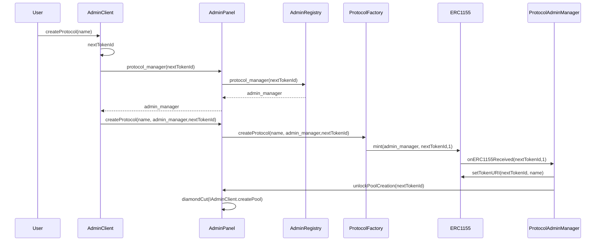

## Architecture



## Deployments

| Network | Contract | Address | Description |
|---------|----------|---------|-------------|
| Unichain Sepolia | ProtocolAdminClient | [`0x957e136698d545abb754b279f3c8e0717568f027`](https://unichain-sepolia.blockscout.com/address/0x957e136698d545abb754b279f3c8e0717568f027) | Main admin client contract for protocol management |
| Unichain Sepolia | ProtocolAdminRegistry | [`0x6af90ec19fc3bf2e0f507a8c331bd1bd371ad879`](https://unichain-sepolia.blockscout.com/address/0x6af90ec19fc3bf2e0f507a8c331bd1bd371ad879) | Registry for protocol admin managers |
| Unichain Sepolia | ProtocolFactoryFacet | [`0x07762d20b4601ff482ef77f97306754c8a0cb399`](https://unichain-sepolia.blockscout.com/address/0x07762d20b4601ff482ef77f97306754c8a0cb399) | Factory facet for creating protocol instances |


**Deployment Transaction**: [`0x018b4e4aa92a571c567f06385062c755adad4683dc3c6d9d381843a785ab74b6`](https://unichain-sepolia.blockscout.com/tx/0x018b4e4aa92a571c567f06385062c755adad4683dc3c6d9d381843a785ab74b6)

> **Note**: Deploy using `make deploy flag=--all`

## Quick Start

### Deployment
```sh
make deploy flag=--all

```

### Initialize

Initialize the protocol admin client with the registry, factory facet, and base URI.

```sh
make initialize baseURI="http://localhost:3000/metadata/"
```

**Parameters:**
- `baseURI` - Base URI for protocol metadata (required)

### Create Protocol

Create a new protocol instance with the specified name.

```sh
make create-protocol name="MyProtocol"
```

**Parameters:**
- `name` - Protocol name (required)

