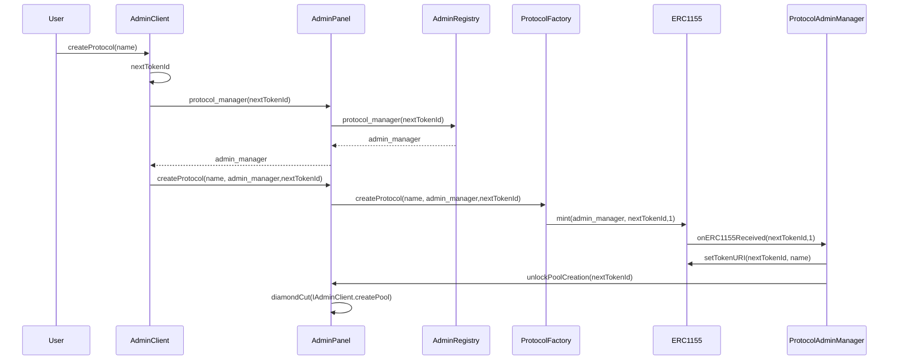

## Architecture



## Deployments

| Network | Contract | Address | Description |
|---------|----------|---------|-------------|
| Unichain Sepolia | ProtocolAdminClient | [`0xca7cbe4739eab3e0b7ebf5418ec37ecfe6bde564`](https://unichain-sepolia.blockscout.com/address/0xca7cbe4739eab3e0b7ebf5418ec37ecfe6bde564) | Main admin client contract for protocol management |
| Unichain Sepolia | ProtocolAdminRegistry | [`0x713b2a2f0fd8aa7699a2540cf64c7a6967775c01`](https://unichain-sepolia.blockscout.com/address/0x713b2a2f0fd8aa7699a2540cf64c7a6967775c01) | Registry for protocol admin managers |
| Unichain Sepolia | ProtocolFactoryFacet | [`0x3aacf294a760c88044d6c245bb9582286c5b81c3`](https://unichain-sepolia.blockscout.com/address/0x3aacf294a760c88044d6c245bb9582286c5b81c3) | Factory facet for creating protocol instances |


**Deployment Transaction**: [`0xe68607c970aa37d9dd34eb85658a86af54ced4f189842ac249822e2856b72546`](https://unichain-sepolia.blockscout.com/tx/0xe68607c970aa37d9dd34eb85658a86af54ced4f189842ac249822e2856b72546)

> **Note**: Deploy using `make deploy flag=--all`

## Quick Start

### Deployment
```sh
make deploy flag=--all

```

### Initialize

Initialize the protocol admin client with the registry, factory facet, and base URI.

```sh
make initialize baseURI="http://localhost:3000/metadata/"
```

**Parameters:**
- `baseURI` - Base URI for protocol metadata (required)

### Create Protocol

Create a new protocol instance with the specified name.

```sh
make create-protocol name="MyProtocol"
```

**Parameters:**
- `name` - Protocol name (required)

