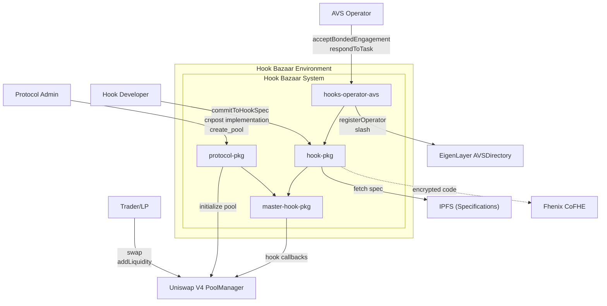
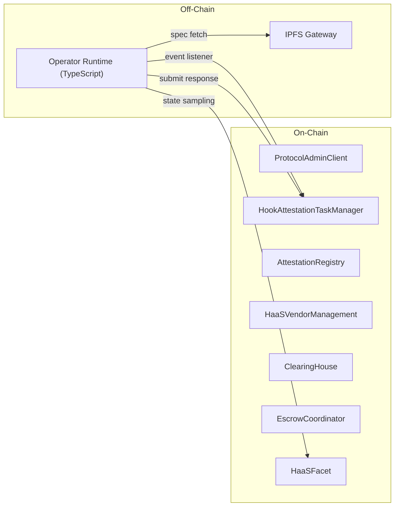

# Hook Bazaar Documentation

## Solution Overview

Hook Bazaar solves critical market failures in the Uniswap V4 hooks ecosystem:

- **Missing Marketplace**: Connects hook supply (developers) with demand (protocol designers) through a centralized discovery layer
- **High Barriers to Entry**: Reduces time-to-deployment from weeks to minutes with pre-verified, ready-made hooks
- **No Developer Incentives**: Enables direct monetization via fixed-price, revenue-share, or hybrid licensing models
- **Lack of Standardization**: Enforces mathematical specifications (Hook Specification Format) for objective behavior verification
- **No Composition Mechanism**: Provides MasterHook Diamond pattern for safe multi-hook execution with selector-level routing
- **No IP Protection**: Integrates Fhenix CoFHE for encrypted implementations that cannot be decompiled
- **No Trust Mechanism**: Delivers cryptoeconomic guarantees through EigenLayer AVS with slashing for false attestations

**Value Delivery:**
- Hook developers: IP protection, monetization, reputation building
- Protocol designers: Instant deployment, lower costs, pre-verified hooks
- Ecosystem: Self-sustaining economics, quality improvement through competition

Reference: [problem-description.md](./problem-description.md)

## Architecture

### System Context

The following diagram establishes the system boundary and identifies external actors that jointly achieve Hook Bazaar's mission:

**Goal**: Define environment boundary and communication channels between Hook Bazaar and external systems required to achieve composite system goals.

### On-Chain / Off-Chain Boundary

**Goal**: Separate concerns between immutable on-chain contracts and upgradeable off-chain verification logic.

### Data Flow Summary

Primary flows that realize system responsibilities:

1. **Protocol Creation**: `ProtocolAdmin` -> `ProtocolAdminClient` -> `ProtocolAdminRegistry` -> `ProtocolAdminManager`
2. **Pool Creation**: `ProtocolAdmin` -> `ProtocolAdminClient` -> `ProtocolHookMediator` -> `UniswapV4.initialize`
3. **Hook Registration**: `HookDeveloper` -> `HaaSVendorManagement.commitToHookSpec` -> `HookLicense NFT`
4. **Attestation Flow**: `createAttestationTask` -> `OperatorRuntime` -> `respondToAttestationTask` -> `AttestationRegistry`
5. **Bonded Engagement**: `HookDeveloper` -> `EscrowCoordinator.postBond` -> `ClearingHouse.acceptBondedEngagement`

Reference: [context-diagram.md](./context-diagram.md)

### Bonded Hooks Comparison

Hook Bazaar and Bonded Hooks are complementary solutions for different market segments:

| Dimension | Bonded Hooks | Hook Bazaar |
|-----------|-------------|-------------|
| Primary Focus | Low-code hook composition | IP-protected hook marketplace |
| Target User | Pool admins, non-developers | Hook developers, integrators |
| Verification | Centralized AVS operator | Decentralized EigenLayer AVS |
| IP Model | Open source commands | Encrypted implementations |
| Composability | Native command chaining | Diamond facet routing |

**Key Differentiator**: Hook Bazaar provides mathematical specification verification with cryptoeconomic guarantees (slashing), while Bonded Hooks prioritizes ease of use through pre-built command blocks.

**Integration Potential**: Hook Bazaar verified hooks could be wrapped as Bonded Hooks commands, combining IP protection with composability.

Reference: [bonded-hooks-comparison.md](./hook-pkg/architecture/bonded-hooks-comparison.md)

**EigenLayer Integration**: The off-chain operator runtime implements the verification workflow with planned BLS signature aggregation for multi-operator consensus. See [operator/README.md](../operator/README.md) for implementation details and EigenLayer component dependencies.

---

## System-Level Documents

| Document | Description |
|----------|-------------|
| [mission-statement.json](./mission-statement.json) | System purpose, responsibilities, exclusions (JSON schema) |
| [function-refinement-tree.json](./function-refinement-tree.json) | Hierarchical service decomposition (JSON schema) |
| [context-diagram.md](./context-diagram.md) | System boundary and external actor interactions |
| [problem-description.md](./problem-description.md) | Market failures and value propositions |

## Package Documentation

### protocol-pkg

Protocol lifecycle management for Uniswap V4 pool administration.

| Document | Description |
|----------|-------------|
| [solutionSpec.md](./protocol-pkg/solutionSpec.md) | Context diagram, workflow, state transitions |
| [roadmap.md](./protocol-pkg/roadmap.md) | Implementation status and TODOs |

**Key Contracts:**
- `ProtocolAdminClient` - Entry point for protocol/pool creation
- `ProtocolAdminManager` - Per-protocol access control

### hooks-operator-avs (Hook Attestation)

EigenLayer AVS for hook specification verification.

| Document | Description |
|----------|-------------|
| [solutionSpec.md](./hook-attestation-pkg/solutionSpec.md) | Attestation flow, challenge mechanism, bonded engagement |
| [roadmap.md](./hook-attestation-pkg/roadmap.md) | Contract and operator implementation status |

**Key Contracts:**
- `HookAttestationTaskManager` - Task creation and response handling
- `AttestationRegistry` - Attestation storage and validity
- `HaaSVendorManagement` - HookLicense NFT issuance
- `ClearingHouse` / `EscrowCoordinator` - Bonded engagement

**Off-Chain:**
- [operator/README.md](../operator/README.md) - Operator runtime with EigenLayer integration roadmap
- `operator/src/HookAttestationAVS.ts` - Main runtime
- `operator/src/processor.ts` - Task processing pipeline

### hook-pkg

Hook development, marketplace, and IP protection.

#### hook-pkg/development

Base contracts for HaaS-compliant hook implementation.

| Document | Description |
|----------|-------------|
| [solutionSpec.md](./hook-pkg/development/solutionSpec.md) | HaaSMod storage, HaaSFacet callbacks, authorization |
| [roadmap.md](./hook-pkg/development/roadmap.md) | Implementation status |

**Key Contracts:**
- `HaaSMod` - Diamond-compatible base storage
- `HaaSFacet` - IHooks implementation template

#### hook-pkg/market

Hook discovery, licensing, and revenue distribution.

| Document | Description |
|----------|-------------|
| [solutionSpec.md](./hook-pkg/market/solutionSpec.md) | Pricing models, Splits integration, license lifecycle |
| [roadmap.md](./hook-pkg/market/roadmap.md) | Marketplace implementation status |

**Key Interfaces:**
- `IHaaSMarket` - Marketplace operations
- `IHookLicenseIssuer` - License management

#### hook-pkg/cofhe-haas

Fhenix CoFHE integration for IP-protected hooks.

| Document | Description |
|----------|-------------|
| [solutionSpec.md](./hook-pkg/cofhe-haas/solutionSpec.md) | Encryption architecture, callback flow, security |
| [roadmap.md](./hook-pkg/cofhe-haas/roadmap.md) | CoFHE implementation status |

**Key Contracts:**
- `CoFHEHook` - IHooks wrapper with encryption boundary
- `ICoFHEHookMod` - Encrypted callback interface

### hook-market-pkg

Extended marketplace documentation.

| Document | Description |
|----------|-------------|
| [market_structure_docs.md](./hook-market-pkg/market_structure_docs.md) | Trading mechanisms analysis |
| [integrations.md](./hook-market-pkg/integrations.md) | Splits protocol integration |

## Architecture References

Located in `docs/hook-pkg/architecture/`:

| Document | Description |
|----------|-------------|
| [mission-statement.md](./hook-pkg/architecture/mission-statement.md) | Strategic foundation (Markdown) |
| [avs-verification-system.md](./hook-pkg/architecture/avs-verification-system.md) | AVS technical specification |
| [bonded-hooks-comparison.md](./hook-pkg/architecture/bonded-hooks-comparison.md) | Comparison with Bonded Hooks |
| [function-refinement-tree.md](./hook-pkg/architecture/function-refinement-tree.md) | Detailed function decomposition |

## Documentation Standards

Per [requirements-specification-agent-system-prompt.md](../agents/requirements-specification-agent-system-prompt.md):

- All diagrams use Mermaid syntax
- JSON schemas for Mission Statement and Function Refinement Tree
- Per-package `solutionSpec.md` and `roadmap.md` required
- Code hyperlinks mandatory for traceability
- No emojis in technical documentation
