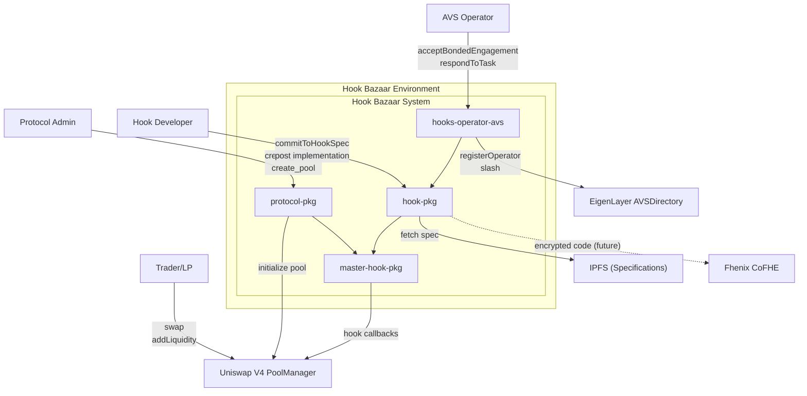
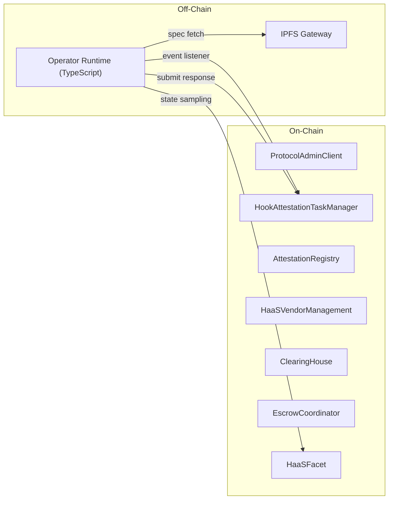

# Hook Bazaar: System Context Diagram

## Context Diagram

## Actor Descriptions

| Actor | Role | Primary Interactions |
|-------|------|---------------------|
| **Protocol Admin** | Creates protocols and pools | `create_protocol`, `create_pool`, `delegatePoolCreatorRole` |
| **Hook Developer** | Builds and monetizes hooks | `commitToHookSpec`, deploy `HaaSFacet` implementations |
| **AVS Operator** | Verifies hook compliance | `acceptBondedEngagement`, `respondToAttestationTask` |
| **Trader/LP** | End user of pools | Swaps and liquidity operations via Uniswap V4 |

## External System Boundaries

| System | Interface Type | Purpose |
|--------|---------------|---------|
| **Uniswap V4 PoolManager** | Smart Contract | Pool initialization, swap execution, hook callbacks |
| **EigenLayer AVSDirectory** | Smart Contract | Operator registration, stake management, slashing |
| **IPFS** | Storage | Hook specification documents (JSON/YAML) |
| **Fhenix CoFHE** | Encryption | IP-protected hook implementations (future) |

## Communication Channels

## Data Flow Summary

1. **Protocol Creation**: `ProtocolAdmin` -> `ProtocolAdminClient` -> `ProtocolAdminRegistry` -> `ProtocolAdminManager`
2. **Pool Creation**: `ProtocolAdmin` -> `ProtocolAdminClient` -> `ProtocolHookMediator` -> `UniswapV4.initialize`
3. **Hook Registration**: `HookDeveloper` -> `HaaSVendorManagement.commitToHookSpec` -> `HookLicense NFT`
4. **Attestation Flow**: `createAttestationTask` -> `OperatorRuntime` -> `respondToAttestationTask` -> `AttestationRegistry`
5. **Bonded Engagement**: `HookDeveloper` -> `EscrowCoordinator.postBond` -> `ClearingHouse.acceptBondedEngagement`
