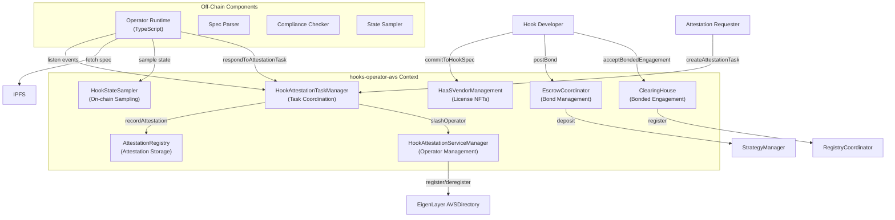
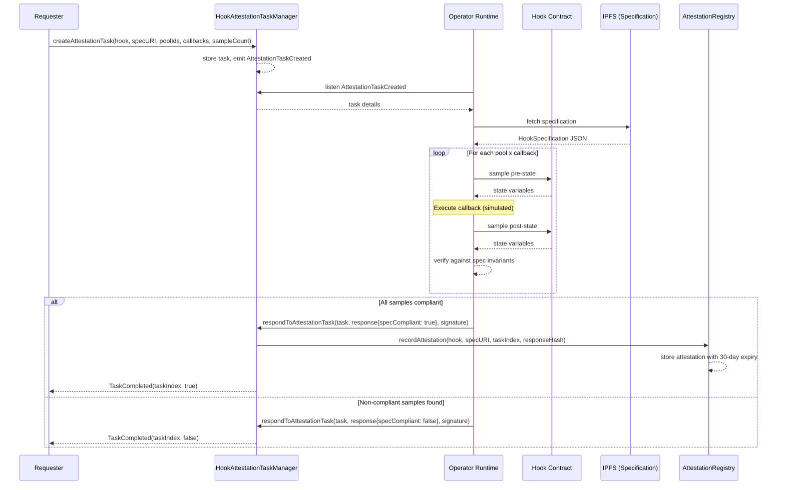
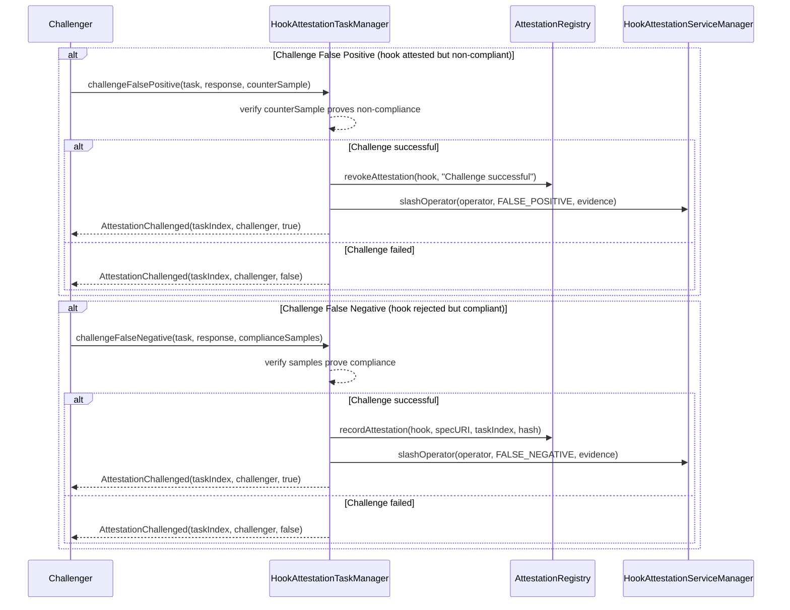
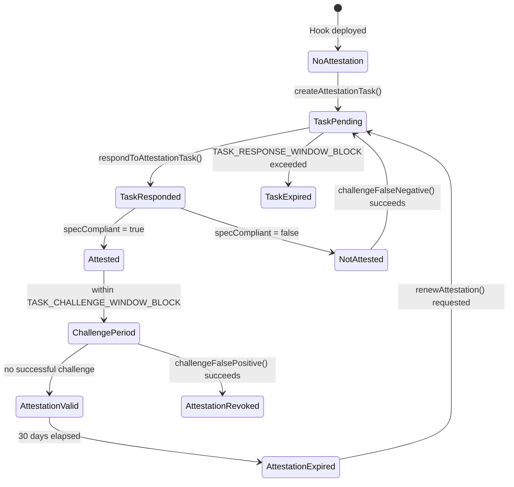
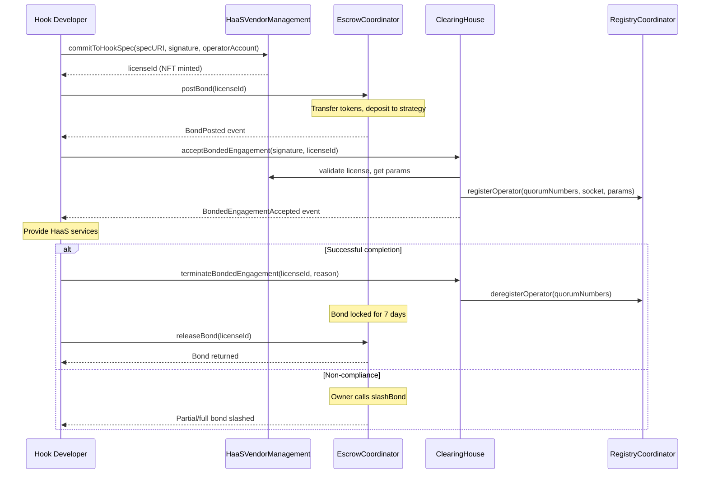

# hooks-operator-avs: Solution Specification

## Problem Description

Hook integrators need trustless guarantees that hook implementations conform to advertised specifications. Traditional audits are:
- Point-in-time (don't catch runtime violations)
- Expensive (prohibitive for small hooks)
- Opaque (integrators must trust auditor reputation)

The system requires:
- Continuous behavioral verification against specifications
- Economic accountability via staked collateral
- Challenge mechanisms for false attestations
- Decentralized operator network for sampling

## Solution Overview

The `hooks-operator-avs` package implements an EigenLayer AVS for hook specification verification:



## Component Responsibilities

| Contract | Source | Responsibility |
|----------|--------|----------------|
| `HookAttestationTaskManager` | [src/hooks-operator-avs/HookAttestationTaskManager.sol](../../contracts/src/hooks-operator-avs/HookAttestationTaskManager.sol) | Task creation, response handling, challenge processing |
| `HookAttestationServiceManager` | [src/hooks-operator-avs/HookAttestationServiceManager.sol](../../contracts/src/hooks-operator-avs/HookAttestationServiceManager.sol) | Operator registration, stake management, slashing |
| `AttestationRegistry` | [src/hooks-operator-avs/AttestationRegistry.sol](../../contracts/src/hooks-operator-avs/AttestationRegistry.sol) | Attestation storage, validity, revocation |
| `HaaSVendorManagement` | [src/hooks-operator-avs/HaaSVendorManagement.sol](../../contracts/src/hooks-operator-avs/HaaSVendorManagement.sol) | HookLicense NFT minting, developer registration |
| `ClearingHouse` | [src/hooks-operator-avs/ClearingHouse.sol](../../contracts/src/hooks-operator-avs/ClearingHouse.sol) | Bonded engagement acceptance/termination |
| `EscrowCoordinator` | [src/hooks-operator-avs/EscrowCoordinator.sol](../../contracts/src/hooks-operator-avs/EscrowCoordinator.sol) | Bond posting, release, slashing |
| `HookStateSampler` | [src/hooks-operator-avs/HookStateSampler.sol](../../contracts/src/hooks-operator-avs/HookStateSampler.sol) | On-chain state sampling for hooks |

## Off-Chain Operator Components

| Module | Source | Responsibility |
|--------|--------|----------------|
| `HookAttestationAVS` | [operator/src/HookAttestationAVS.ts](../../operator/src/HookAttestationAVS.ts) | Main runtime, event listener, response submission |
| `processor` | [operator/src/processor.ts](../../operator/src/processor.ts) | Task processing orchestration |
| `specParser` | [operator/src/specParser.ts](../../operator/src/specParser.ts) | Specification fetching and parsing |
| `complianceChecker` | [operator/src/complianceChecker.ts](../../operator/src/complianceChecker.ts) | State sample verification against spec |
| `stateSampler` | [operator/src/stateSampler.ts](../../operator/src/stateSampler.ts) | State collection from hooks |

## Attestation Task Workflow



## Challenge Mechanism



## State Transition Diagram: Attestation Lifecycle



## Slashing Conditions

| Offense | Slash Percentage | Condition |
|---------|-----------------|-----------|
| `OPERATOR_COLLUSION` | 100% | Multiple operators coordinate false attestations |
| `FALSE_POSITIVE` | 50% | Attested non-compliant hook as compliant |
| `FALSE_NEGATIVE` | 30% | Rejected compliant hook as non-compliant |
| `SAMPLE_MANIPULATION` | 20% | Tampered with state sampling |

## Bonded Engagement Flow



## Data Structures

```solidity
// AttestationTask
struct AttestationTask {
    address hook;
    string specificationURI;
    bytes32[] poolIds;
    bytes4[] callbacks;
    uint32 sampleCount;
    uint32 taskCreatedBlock;
    bytes quorumNumbers;
    uint32 quorumThresholdPercentage;
}

// Attestation
struct Attestation {
    bytes32 attestationId;
    address hook;
    string specificationURI;
    bool isValid;
    uint256 attestedAt;
    uint256 expiresAt;
    uint32 taskIndex;
    bytes32 responsesHash;
}

// HookLicense
struct HookLicense {
    uint256 licenseId;
    StrategyParams[] haasStrategies;
    address socketManager;
}

// BondDetails
struct BondDetails {
    IERC20 paymentToken;
    uint256 bondAmount;
    uint256 depositedAmount;
    address depositor;
    uint256 lockedUntil;
    bool isActive;
}
```

## Constants

| Constant | Value | Contract |
|----------|-------|----------|
| `TASK_RESPONSE_WINDOW_BLOCK` | 100 blocks | HookAttestationTaskManager |
| `TASK_CHALLENGE_WINDOW_BLOCK` | 200 blocks | HookAttestationTaskManager |
| `COMPLIANCE_TOLERANCE` | 100 bps (1%) | HookAttestationTaskManager |
| `ATTESTATION_VALIDITY_PERIOD` | 30 days | AttestationRegistry |
| `BOND_LOCK_PERIOD` | 7 days | EscrowCoordinator |
