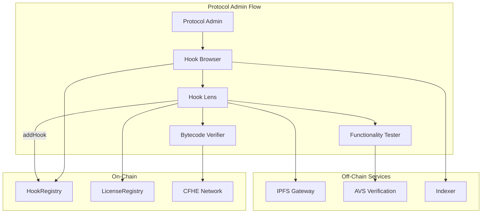
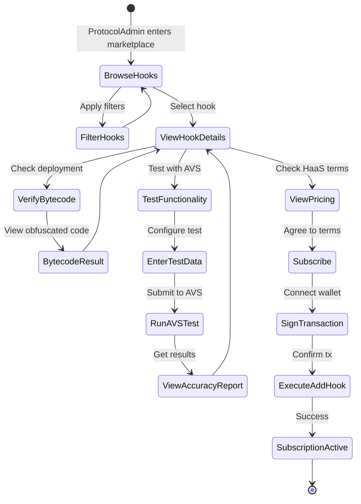
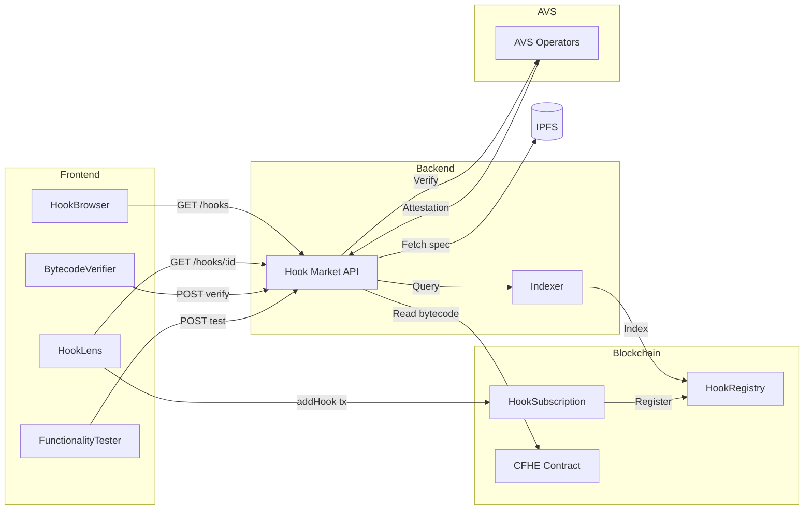

# Hook Market Service Specification

## Problem Description

Protocol Administrators (ProtocolAdmins) need a marketplace to discover, evaluate, and subscribe to hooks for their Uniswap v4 pools. The system must:

1. Provide browsable hook catalog from on-chain HookLicense database
2. Display HaaS (Hook-as-a-Service) subscription pricing and terms
3. Enable subscription purchase via `addHook` transaction
4. Verify deployed code matches registered bytecode (obfuscated)
5. Allow functionality testing via AVS verification service

---

## Solution Overview



---

## Data Models

### HookListing (On-Chain + IPFS)

```typescript
interface HookListing {
  // On-chain data
  tokenId: number;              // HookLicense NFT token ID
  developer: address;           // Hook developer address
  registeredAt: number;         // Block timestamp
  deprecated: boolean;          // Deprecation status

  // Pricing (on-chain)
  pricing: HookPricing;

  // IPFS metadata
  metadata: {
    name: string;
    version: string;
    description: string;
    category: HookCategory;
    tags: string[];
    capabilities: HookCapability[];
  };

  // Verification status
  verification: {
    codeVerified: boolean;
    avsAttestationId?: string;
    complianceScore?: number;
    cfheDeployed: boolean;
  };
}

type HookCategory =
  | 'FEE_MANAGEMENT'      // Dynamic fees, fee sharing
  | 'ORACLE'              // Price oracles, TWAP
  | 'LIMIT_ORDER'         // Limit orders, stop-loss
  | 'LIQUIDITY'           // LP incentives, auto-rebalance
  | 'MEV_PROTECTION'      // MEV mitigation
  | 'CUSTOM';             // Other

interface HookCapability {
  callback: HookCallback;
  description: string;
}

interface HookPricing {
  model: 'FIXED' | 'REVENUE_SHARE' | 'HYBRID';
  fixedPrice?: bigint;           // One-time fee (wei)
  revenueShareBps?: number;      // Basis points (0-10000)
  currency: address;             // Payment token (address(0) = ETH)
}
```

### HookSubscription

```typescript
interface HookSubscription {
  subscriptionId: bytes32;
  hookTokenId: number;
  poolId: bytes32;
  subscriber: address;          // ProtocolAdmin
  subscribedAt: number;
  active: boolean;

  // Payment tracking
  totalPaid: bigint;
  revenueShareAccrued: bigint;
}
```

### BytecodeVerification

```typescript
interface BytecodeVerificationRequest {
  hookTokenId: number;
  poolId?: bytes32;             // Optional: verify for specific pool
}

interface BytecodeVerificationResult {
  verified: boolean;
  obfuscatedBytecodeHash: string;
  deployedBytecodeHash: string;
  matchPercentage: number;      // 0-100
  cfheContractAddress?: string;
  encryptionStatus: 'ENCRYPTED' | 'PLAINTEXT' | 'NOT_DEPLOYED';
}
```

### FunctionalityTest

```typescript
interface FunctionalityTestRequest {
  hookTokenId: number;
  testType: 'SWAP' | 'LIQUIDITY' | 'INITIALIZE' | 'CUSTOM';
  testData: {
    // Swap test
    swapParams?: {
      zeroForOne: boolean;
      amountSpecified: bigint;
      sqrtPriceLimitX96: bigint;
    };
    // Liquidity test
    liquidityParams?: {
      tickLower: number;
      tickUpper: number;
      liquidityDelta: bigint;
    };
    // Custom test
    customParams?: Record<string, unknown>;
  };
  expectedBehavior?: string;    // Natural language description
}

interface FunctionalityTestResult {
  success: boolean;
  testId: string;
  avsVerificationId: string;

  // Results
  accuracyScore: number;        // 0-100 percentage
  behaviorMatch: boolean;

  // Detailed report
  report: {
    inputSummary: string;
    expectedOutput: string;
    actualOutput: string;
    deviations: TestDeviation[];
    gasUsed: bigint;
    executionTimeMs: number;
  };

  // AVS attestation
  attestation: {
    attestationId: string;
    attesters: address[];
    consensus: number;          // Percentage of agreeing operators
    timestamp: number;
  };
}

interface TestDeviation {
  field: string;
  expected: string;
  actual: string;
  severity: 'CRITICAL' | 'WARNING' | 'INFO';
}
```

---

## API Endpoints

### GET /hooks

List available hooks from marketplace.

**Query Parameters:**
- `category?: HookCategory` - Filter by category
- `minComplianceScore?: number` - Minimum AVS compliance score
- `verified?: boolean` - Only show verified hooks
- `maxPrice?: string` - Maximum fixed price (wei)
- `maxRevShareBps?: number` - Maximum revenue share
- `page?: number` - Pagination
- `limit?: number` - Results per page (default: 20)

**Response:**
```typescript
interface ListHooksResponse {
  hooks: HookListingSummary[];
  pagination: {
    page: number;
    limit: number;
    total: number;
    hasMore: boolean;
  };
}

interface HookListingSummary {
  tokenId: number;
  name: string;
  version: string;
  category: HookCategory;
  developer: address;
  pricing: HookPricing;
  complianceScore?: number;
  verified: boolean;
  subscriptionCount: number;
}
```

### GET /hooks/:tokenId

Get detailed hook information.

**Response:**
```typescript
interface GetHookResponse {
  hook: HookListing;
  spec: HookSpec;                // Full specification from IPFS
  subscriptions: number;         // Total subscription count
  pools: PoolDeployment[];       // Pools using this hook
}

interface PoolDeployment {
  poolId: bytes32;
  chainId: number;
  deployedAt: number;
  active: boolean;
}
```

### POST /hooks/:tokenId/verify-bytecode

Verify deployed bytecode matches registered hook.

**Request:**
```typescript
interface VerifyBytecodeRequest {
  poolId?: bytes32;
  chainId?: number;
}
```

**Response:** `BytecodeVerificationResult`

### POST /hooks/:tokenId/test-functionality

Run functionality test via AVS.

**Request:** `FunctionalityTestRequest`

**Response:** `FunctionalityTestResult`

### POST /hooks/:tokenId/subscribe

Generate subscription transaction data.

**Request:**
```typescript
interface SubscribeRequest {
  poolId: bytes32;
  signature: string;            // EIP-712 signature
}
```

**Response:**
```typescript
interface SubscribeResponse {
  transactionData: {
    to: address;
    data: bytes;
    value: bigint;
  };
  estimatedGas: bigint;
  pricing: {
    fixedCost: bigint;
    revenueShareBps: number;
  };
}
```

---

## Contracts Integration

### IHookRegistry

```solidity
interface IHookRegistry {
    struct HookInfo {
        uint256 tokenId;
        address developer;
        uint256 registeredAt;
        bool deprecated;
        bytes32 specCid;        // IPFS CID
        bytes32 bytecodeHash;   // Deployed bytecode hash
    }

    struct Pricing {
        PricingModel model;
        uint256 fixedPrice;
        uint16 revenueShareBps;
        address currency;
    }

    enum PricingModel { FIXED, REVENUE_SHARE, HYBRID }

    function getHook(uint256 tokenId) external view returns (HookInfo memory);
    function getPricing(uint256 tokenId) external view returns (Pricing memory);
    function getHooksByCategory(bytes32 category) external view returns (uint256[] memory);
    function isVerified(uint256 tokenId) external view returns (bool);
}
```

### IHookSubscription

```solidity
interface IHookSubscription {
    function subscribe(
        uint256 hookTokenId,
        bytes32 poolId,
        bytes calldata signature
    ) external payable returns (bytes32 subscriptionId);

    function getSubscription(bytes32 subscriptionId)
        external view returns (Subscription memory);

    function isSubscribed(bytes32 poolId, uint256 hookTokenId)
        external view returns (bool);

    function addHook(bytes32 poolId, uint256 hookTokenId) external;
}
```

---

## Error Codes

```typescript
type HookMarketErrorCode =
  | 'HOOK_NOT_FOUND'
  | 'HOOK_DEPRECATED'
  | 'HOOK_NOT_VERIFIED'
  | 'INVALID_POOL_ID'
  | 'POOL_NOT_FOUND'
  | 'ALREADY_SUBSCRIBED'
  | 'INSUFFICIENT_PAYMENT'
  | 'INVALID_SIGNATURE'
  | 'SIGNATURE_EXPIRED'
  | 'BYTECODE_MISMATCH'
  | 'CFHE_NOT_DEPLOYED'
  | 'AVS_UNAVAILABLE'
  | 'TEST_TIMEOUT'
  | 'INVALID_TEST_PARAMS';
```

---

## Activity Diagram



---

## Data Flow



---

## Security Considerations

1. **Signature Verification**: All subscription requests require EIP-712 signatures
2. **Price Manipulation**: Fixed prices stored on-chain, immutable after listing
3. **Bytecode Tampering**: CFHE encryption prevents modification
4. **AVS Collusion**: Multiple operators provide consensus on test results
5. **Rate Limiting**: Functionality tests rate-limited per user/hour
