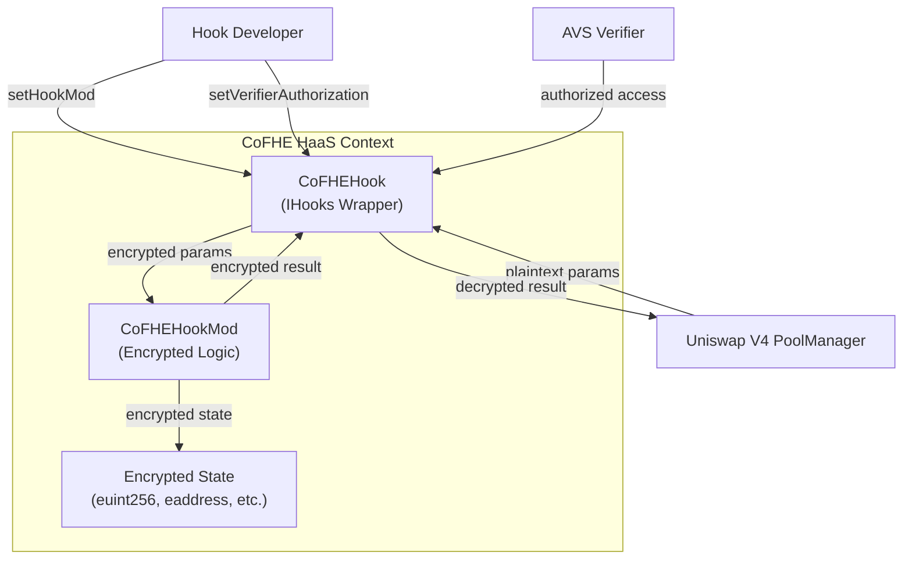
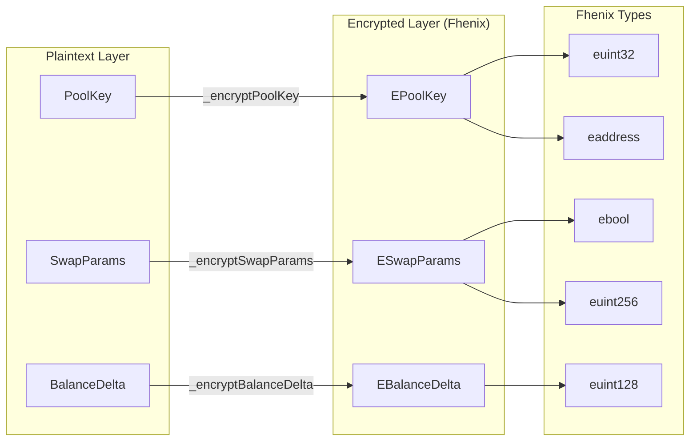
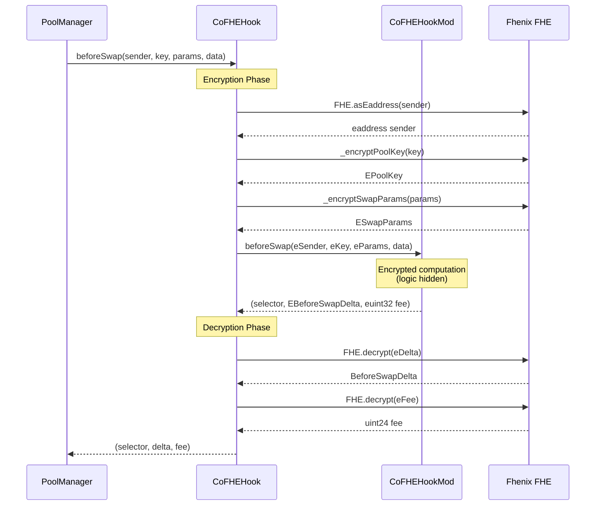
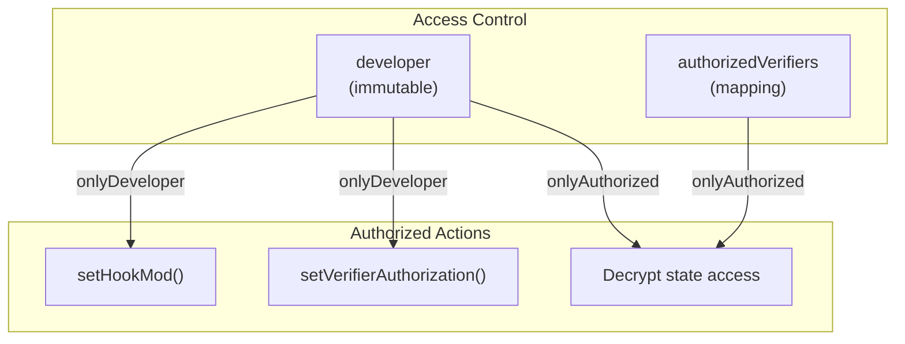
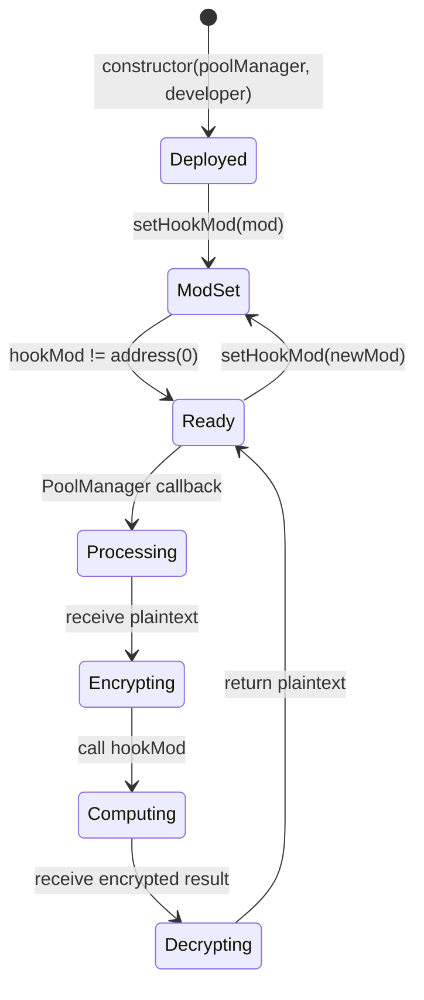
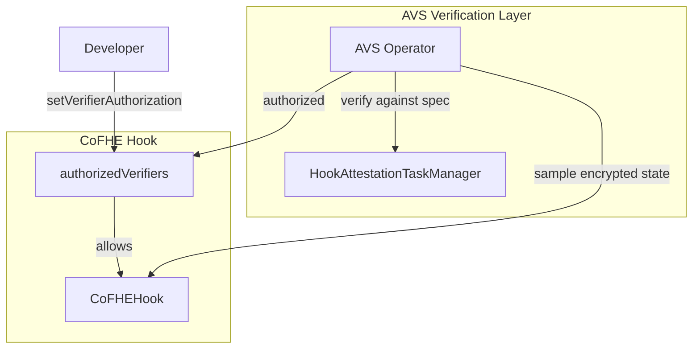

# hook-pkg/cofhe-haas: CoFHE IP Protection Solution Specification

## Problem Description

Hook developers face IP theft risk because:
- Deployed bytecode is publicly readable
- Decompilation reveals algorithmic logic
- Competitors can copy and redeploy without compensation
- Premium algorithms (MEV protection, IL mitigation) lose competitive advantage

## Solution Overview

The CoFHE (Confidential FHE) subsystem provides IP protection through Fhenix encryption:



## Component Responsibilities

| Contract | Source | Responsibility |
|----------|--------|----------------|
| `CoFHEHook` | [src/hook-pkg/CoFHEHook.sol](../../../contracts/src/hook-pkg/CoFHEHook.sol) | IHooks interface, encryption/decryption boundary |
| `ICoFHEHookMod` | [src/hook-pkg/interfaces/ICoFHEHookMod.sol](../../../contracts/src/hook-pkg/interfaces/ICoFHEHookMod.sol) | Encrypted callback interface |
| `ICoFHETypes` | [src/hook-pkg/interfaces/ICoFHETypes.sol](../../../contracts/src/hook-pkg/interfaces/ICoFHETypes.sol) | Encrypted type definitions |

## Encryption Architecture



## Encrypted Type Definitions

```solidity
// Encrypted PoolKey
struct EPoolKey {
    eaddress currency0;
    eaddress currency1;
    euint32 fee;         // uint24 -> euint32
    euint32 tickSpacing; // int24 -> euint32
    eaddress hooks;
}

// Encrypted SwapParams
struct ESwapParams {
    ebool zeroForOne;
    euint256 amountSpecified; // int256 stored as magnitude
    euint256 sqrtPriceLimitX96;
}

// Encrypted ModifyLiquidityParams
struct EModifyLiquidityParams {
    euint32 tickLower;
    euint32 tickUpper;
    euint256 liquidityDelta;
    euint256 salt;
}

// Encrypted BalanceDelta
struct EBalanceDelta {
    euint128 amount0;
    euint128 amount1;
}

// Encrypted BeforeSwapDelta
struct EBeforeSwapDelta {
    euint128 deltaSpecified;
    euint128 deltaUnspecified;
}
```

## Callback Flow



## Authorization Model



## State Transition Diagram



## Security Considerations

| Consideration | Mitigation |
|---------------|------------|
| Developer key compromise | Immutable developer address |
| Verifier collusion | Limited verifier set, slashing via AVS |
| Decryption oracle attacks | onlyAuthorized modifier |
| Gas cost overhead | Batch operations where possible |
| Fhenix availability | Fallback to non-encrypted mode (future) |

## Integration with AVS Verification



## Gas Considerations

| Operation | Estimated Overhead |
|-----------|-------------------|
| Encryption (per param) | ~10-50k gas |
| Decryption (per return) | ~10-50k gas |
| Encrypted computation | ~2-10x plaintext |
| beforeSwap total | ~100-300k gas (vs ~20-50k plaintext) |

Note: Gas costs depend on Fhenix network conditions and encryption complexity.
