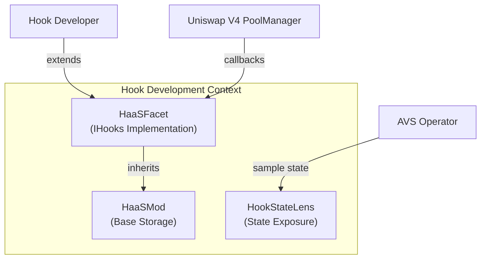
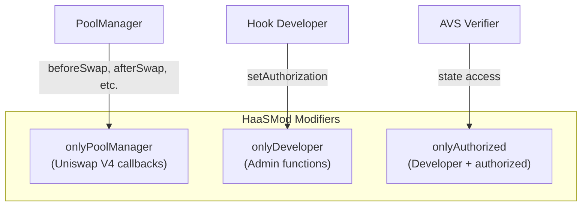
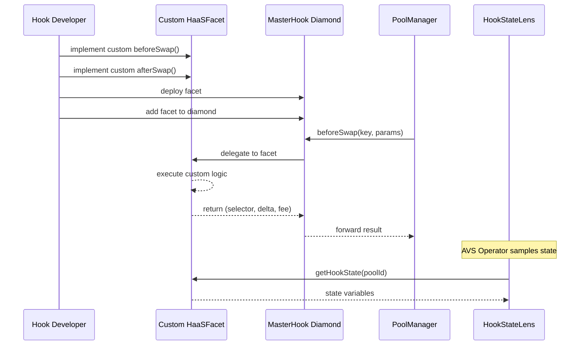
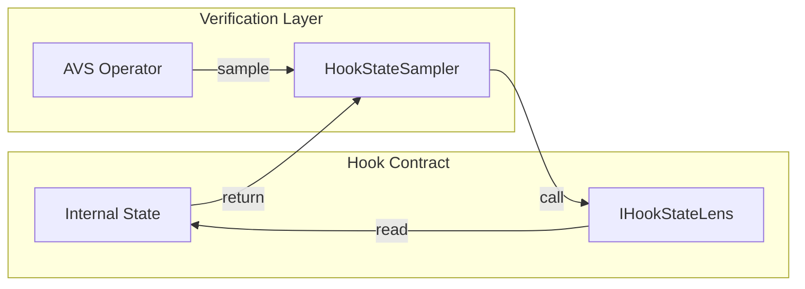

# hook-pkg/development: Hook Development Solution Specification

## Problem Description

Hook developers need:
- Standardized base contracts for Uniswap V4 hook implementation
- Diamond-pattern compatible storage to avoid collisions
- Built-in authorization for developer access control
- State exposure interfaces for AVS verification

## Solution Overview

The development subsystem provides base contracts and patterns for building HaaS-compliant hooks:



## Component Responsibilities

| Contract | Source | Responsibility |
|----------|--------|----------------|
| `HaaSMod` | [src/hook-pkg/HaaSMod.sol](../../../contracts/src/hook-pkg/HaaSMod.sol) | Diamond-compatible storage, authorization modifiers |
| `HaaSFacet` | [src/hook-pkg/HaaSFacet.sol](../../../contracts/src/hook-pkg/HaaSFacet.sol) | IHooks interface with default implementations |
| `HookStateLens` | [src/hook-pkg/HookStateLens.sol](../../../contracts/src/hook-pkg/HookStateLens.sol) | Read-only state access for verification |

## HaaSMod Storage Layout

```solidity
bytes32 constant HAAS_STORAGE_POSITION = keccak256("hook-bazaar.haas.storage");

struct HaaSStorage {
    IPoolManager poolManager;
    IHaaSMarket hooksMarket;
    IHookStateLens hookStateViewer;
    IHookLicenseIssuer hookLicenseIssuer;
    address developer;
    mapping(address => bool) authorizedAccounts;
}
```

## Authorization Model



## Hook Development Workflow



## HaaSFacet Callback Interface

All callbacks return their selector on success, enabling composition detection:

| Callback | Returns | Purpose |
|----------|---------|---------|
| `beforeInitialize` | `bytes4` | Pre-pool setup |
| `afterInitialize` | `bytes4` | Post-pool setup |
| `beforeAddLiquidity` | `bytes4` | Pre-liquidity validation |
| `afterAddLiquidity` | `(bytes4, BalanceDelta)` | Post-liquidity processing |
| `beforeRemoveLiquidity` | `bytes4` | Pre-removal validation |
| `afterRemoveLiquidity` | `(bytes4, BalanceDelta)` | Post-removal processing |
| `beforeSwap` | `(bytes4, BeforeSwapDelta, uint24)` | Pre-swap modification |
| `afterSwap` | `(bytes4, int128)` | Post-swap processing |
| `beforeDonate` | `bytes4` | Pre-donation validation |
| `afterDonate` | `bytes4` | Post-donation processing |

## Integration with HookStateLens



## Example: Custom Hook Implementation

```solidity
contract MyCustomHook is HaaSFacet {
    bytes32 constant MY_STORAGE = keccak256("my.hook.storage");

    struct MyStorage {
        uint256 swapCount;
        mapping(PoolId => uint256) poolSwaps;
    }

    function _getMyStorage() internal pure returns (MyStorage storage $) {
        bytes32 position = MY_STORAGE;
        assembly { $.slot := position }
    }

    function beforeSwap(
        address sender,
        PoolKey calldata key,
        SwapParams calldata params,
        bytes calldata hookData
    ) external override onlyPoolManager returns (bytes4, BeforeSwapDelta, uint24) {
        MyStorage storage $ = _getMyStorage();
        $.swapCount++;
        $.poolSwaps[key.toId()]++;

        return (IHooks.beforeSwap.selector, BeforeSwapDeltaLibrary.ZERO_DELTA, 0);
    }
}
```
