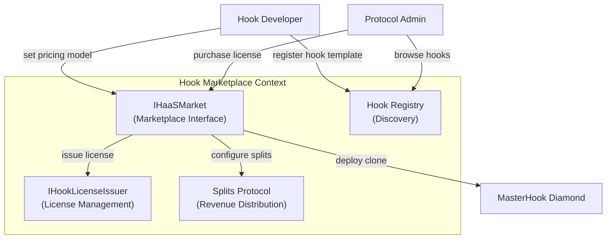
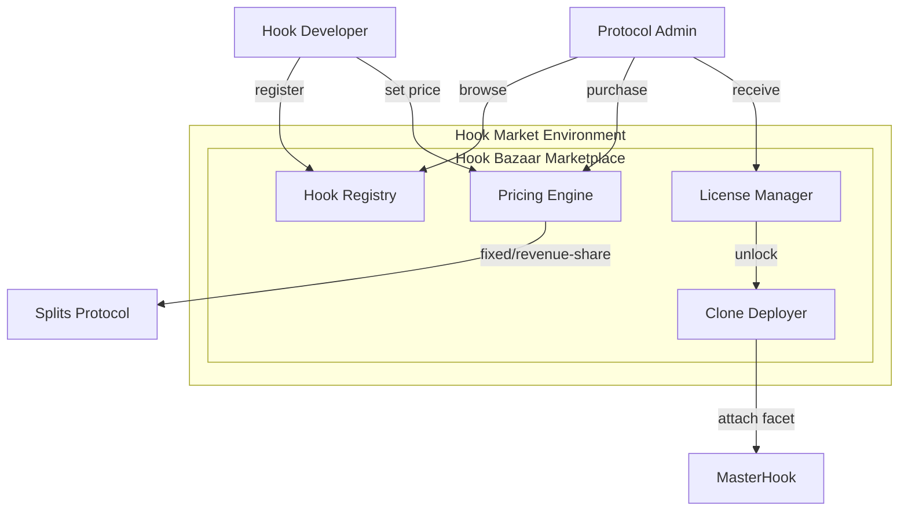
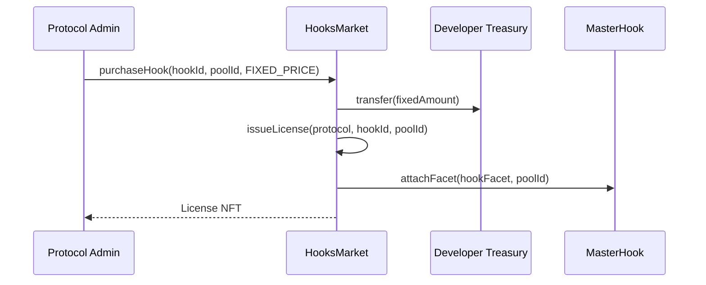
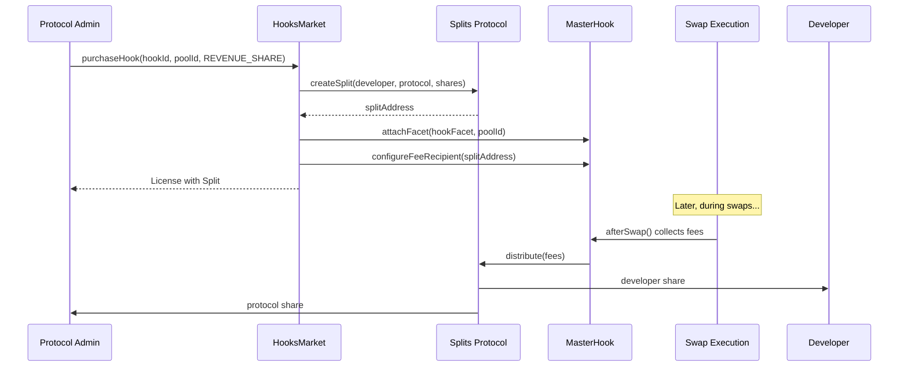
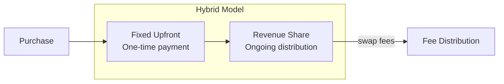
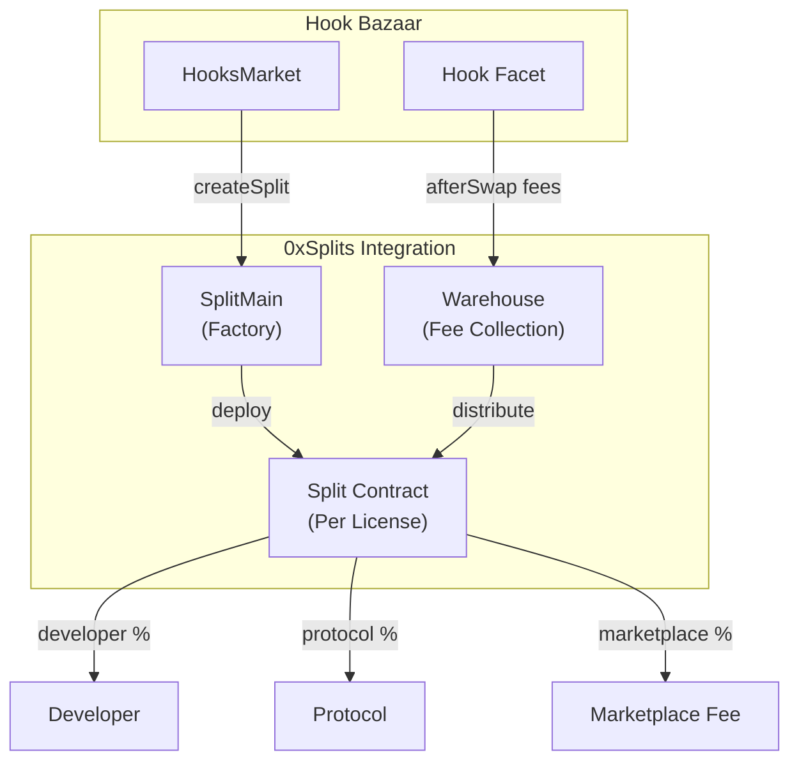
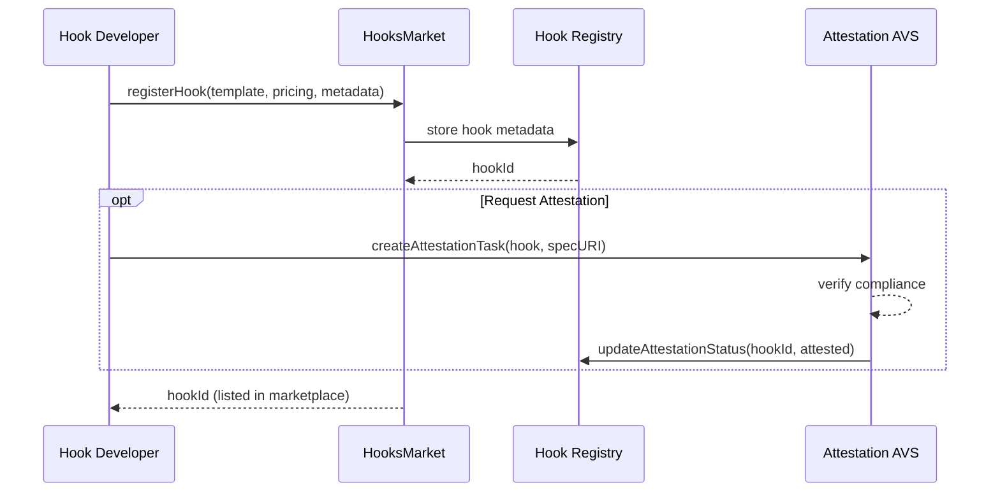
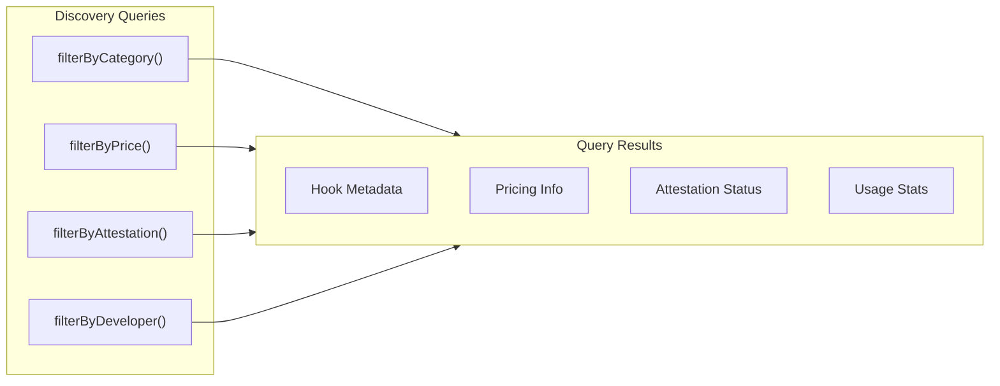
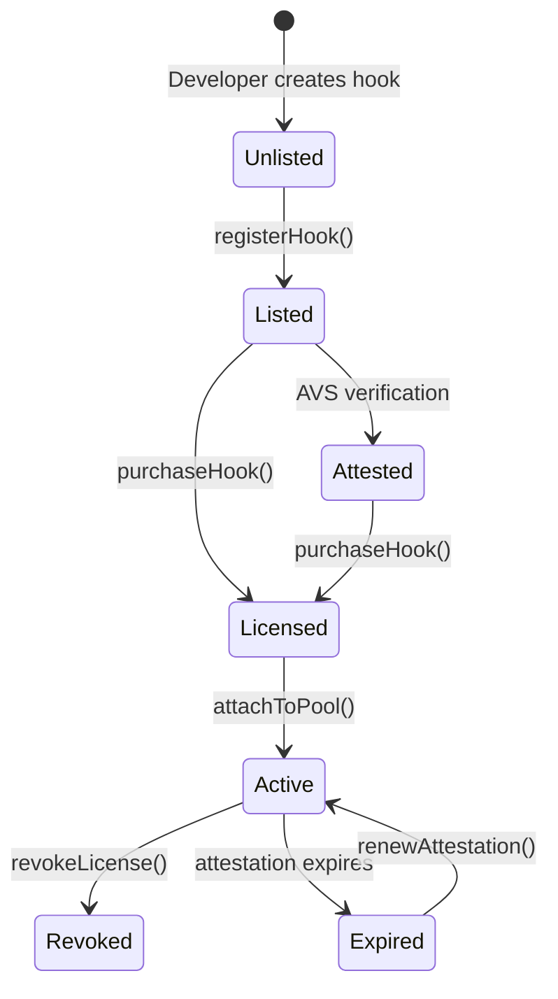

# hook-pkg/market: Hook Marketplace Solution Specification

## Problem Description

The Uniswap V4 hooks ecosystem lacks:
- Centralized discovery for hook implementations
- Standardized pricing and licensing models
- Safe deployment and attachment mechanisms
- Revenue distribution for hook developers

## Solution Overview

The market subsystem provides infrastructure for hook discovery, licensing, and deployment:



## Context Diagram



## Pricing Models

### Fixed Price Licensing



### Revenue Share Licensing



### Hybrid Pricing



## Marketplace Interface

```solidity
interface IHaaSMarket {
    /// @notice Unlock a hook license for a pool
    function unlock(IHookLicenseIssuer licenseIssuer, PoolId poolId) external;

    /// @notice Register a new hook template
    function registerHook(
        address hookTemplate,
        PricingModel pricing,
        bytes calldata metadata
    ) external returns (uint256 hookId);

    /// @notice Purchase a hook license
    function purchaseHook(
        uint256 hookId,
        PoolId targetPool,
        PricingModel selectedModel
    ) external payable returns (uint256 licenseId);

    /// @notice Get hook metadata
    function getHookMetadata(uint256 hookId) external view returns (HookMetadata memory);
}

enum PricingModel {
    FIXED_PRICE,
    REVENUE_SHARE,
    HYBRID
}

struct HookMetadata {
    address developer;
    address template;
    string name;
    string description;
    string specificationURI;
    uint256 fixedPrice;
    uint256 revenueShareBps;
    bool isAttested;
    uint256 attestationExpiry;
}
```

## Integration with Splits Protocol

Reference: [integrations.md](../../hook-market-pkg/integrations.md)



## Revenue Share Safeguards

| Safeguard | Limit | Enforcement |
|-----------|-------|-------------|
| Max developer share | 30% | Marketplace contract |
| Max total hook share | 50% | ProtocolAdmin |
| Min LP share | 50% | Diamond facet |

## Hook Registration Flow



## Discovery Interface



## State Transition: License Lifecycle


