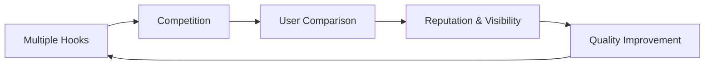

<div align="center">

# Hook Bazaar — Problem Description

**Solving Critical Market Failures in the Uniswap v4 Ecosystem**

</div>

---

## 📋 Table of Contents

- [Overview](#overview)
- [1. Missing Marketplace for Uniswap v4 Hooks](#1-missing-marketplace-for-uniswap-v4-hooks)
- [2. High Barriers to Entry for Protocol Designers](#2-high-barriers-to-entry-for-protocol-designers)
- [3. No Incentive Layer for Hook Developers](#3-no-incentive-layer-for-hook-developers)
- [4. Lack of Standardization, Safety, and Transparency](#4-lack-of-standardization-safety-and-transparency)
- [5. No Mechanism for Multi-Hook Composition](#5-no-mechanism-for-multi-hook-composition)
- [6. No Competition or Selection Mechanism](#6-no-competition-or-selection-mechanism)
- [7. No IP Protection for Hook Developers](#7-no-ip-protection-for-hook-developers)
- [8. Developers and Protocols Cannot Build Reputation](#8-developers-and-protocols-cannot-build-reputation)
- [9. Lack of an Economically Sustainable Ecosystem](#9-lack-of-an-economically-sustainable-ecosystem)
- [Summary](#summary)

---

## Overview

This document describes the fundamental problems that Hook Bazaar solves in the Uniswap v4 ecosystem. It outlines:

- ⚠️ **Core market failures** in the hooks ecosystem
- 💸 **Economic inefficiencies** affecting developers and protocols
- 🏗️ **Missing infrastructure layers** preventing adoption
- ✅ **Value propositions** for each side of the marketplace

---

## 1. Missing Marketplace for Uniswap v4 Hooks

### ⚠️ Problem

Uniswap v4 introduced Hooks, but **no marketplace exists** where:

- ❌ Developers can publish hooks
- ❌ Protocols can discover hooks
- ❌ Hooks can be purchased, evaluated, compared, or trusted

> **Result**: Supply and demand exist, but **no mechanism connects them** → classic two-sided market failure.

### ✅ What Hook Bazaar Solves

| Stakeholder | Benefit |
|------------|---------|
| **Developers** | Place to publish, categorize, and commercialize their work |
| **Protocols** | Accessible discovery layer for hooks that solve business needs |
| **Ecosystem** | Centralized discovery layer connecting supply and demand |

---

## 2. High Barriers to Entry for Protocol Designers

### ⚠️ Problem

To obtain a production-ready hook today, a protocol must:

1. 🔍 Source a qualified developer
2. 📝 Write a specification
3. 💻 Implement the hook
4. 🧪 Test extensively
5. 🔒 Pay for external security audit

> **Cost**: **$10k–$100k+** | **Time**: Weeks to months

Most teams **cannot afford** this barrier.

### ✅ What Hook Bazaar Solves

| Before | After |
|--------|-------|
| $10k–$100k+ | Fraction of the cost |
| Weeks to months | **Minutes** |
| Custom development | Ready-made, vetted hooks |
| High risk | Pre-audited, battle-tested |

**Benefits**:
- ✅ Ready-made, vetted hooks
- ✅ Significantly cheaper than custom development
- ✅ Time-to-market drops from weeks to minutes
- ✅ Avoid R&D, testing overhead, and audit cycles

---

## 3. No Incentive Layer for Hook Developers

### ⚠️ Problem

Developers have no:

- 📦 Marketplace to publish hooks
- 👥 Audience to discover their work
- 💰 Monetization model
- 🔄 Feedback loop
- 🏆 Way to build professional reputation

> Uniswap v4 offers powerful primitives but **no economic layer** that rewards innovation.

### ✅ What Hook Bazaar Solves

**Monetization Options**:
- 💵 **Flat price**: One-time payment
- 📈 **Revenue share**: % of swap fees
- 🔄 **Hybrid**: Combination of both

**Professional Development**:
- 🎯 Direct exposure to protocol teams
- 📊 **Hook Developer Reputation Profiles**
- 🚀 Encourages a new professional category: *Hook Developers*

---

## 4. Lack of Standardization, Safety, and Transparency

### ⚠️ Problem

Protocols cannot trust external hooks because there is no:

| Missing Infrastructure | Impact |
|----------------------|--------|
| ❌ Standardized specification format | Cannot compare hooks objectively |
| ❌ Risk rating system | No safety guarantees |
| ❌ Audit metadata | Cannot verify security |
| ❌ Version tracking | No upgrade path |
| ❌ Safety guarantees | High adoption risk |

> Protocol teams **cannot objectively evaluate** a hook's correctness or safety.

### ✅ What Hook Bazaar Solves

- 📋 Enforces standardized **Hook Specification Format (HSF)**
- 🔒 Provides clear audit status and risk flags
- 📖 Documents hook behavior, state transitions, and category
- 🔍 Ensures transparent metadata for each hook

---

## 5. No Mechanism for Multi-Hook Composition

### ⚠️ Problem

Uniswap v4 supports multi-hook execution, but:

```
❌ No interface for hook composition
❌ Hooks may conflict with each other
❌ No tooling to manage ordering
❌ No built-in governance around selector routing
```

> This prevents protocols from **combining multiple behaviors safely**.

### ✅ What Hook Bazaar Solves

**MasterHook (Diamond Pattern)**:

```
✅ Multi-hook routing via Diamond facets
✅ Selector-level conflict detection
✅ Per-pool attach/detach of hook facets
✅ Configurable execution ordering
```

**Result**: Safe, composable hook execution.

---

## 6. No Competition or Selection Mechanism

### ⚠️ Problem

Hooks operate in isolation:

- 🚫 No competition between alternative solutions
- 💸 No clear pricing benchmark
- 📊 No feedback on performance
- 📈 No incentive for developers to improve

> Without a marketplace, **the best hooks do not naturally rise to the top**.

### ✅ What Hook Bazaar Solves

**Market Dynamics**:



- 🏆 Creates a competitive environment
- 📊 Users compare performance, price, features
- ⭐ Reputation and visibility drive developer quality
- 💰 Market forces establish fair pricing

---

## 7. No IP Protection for Hook Developers

### ⚠️ Problem

**All hook code is public** → trivial to copy.

This prevents professional developers from building premium algorithms:
- 🛡️ MEV mitigation engines
- 💧 IL (Impermanent Loss) protection
- 📈 Dynamic fee curves
- 🎯 Advanced trading strategies

> No IP protection = No incentive for premium development.

### ✅ What Hook Bazaar Solves

**Fhenix FHE Integration**:

| Feature | Benefit |
|---------|---------|
| 🔐 Encrypted bytecode | Code remains confidential |
| 🔑 Encrypted parameters | Private configuration |
| 🗄️ Encrypted state | Hidden internal state |
| 🧮 Confidential computation | Execution without revealing logic |

> Developers can safely publish **proprietary algorithms** without fear of theft.

---

## 8. Developers and Protocols Cannot Build Reputation

### ⚠️ Problem

There is no:

| Missing Element | Impact |
|----------------|--------|
| ⭐ Rating system | Cannot trust unknown developers |
| 📊 Usage history | No proof of reliability |
| 📈 Performance metrics | Cannot compare effectiveness |
| 🎖️ Audit badges | No security verification |
| 🔒 Trust model | High risk, slow adoption |

> Adoption becomes **risky and slow**.

### ✅ What Hook Bazaar Solves

**Reputation System**:

- 👤 **Hook Developer Reputation Profiles**
- 📊 **Hook Performance Metrics**
- ✅ **Verified Hook Labels** (audited, tested, etc.)
- 📈 **Usage statistics** and historical data

> Creates a **social and credibility layer** for hook adoption.

---

## 9. Lack of an Economically Sustainable Ecosystem

### ⚠️ Problem

**Without a revenue model**:

```
No revenue → Devs won't build hooks
           → Protocols won't adopt hooks
           → Marketplace cannot grow
           → Ecosystem collapses
```

### ✅ What Hook Bazaar Solves

**Multi-Stream Monetization Model**:

| Revenue Stream | Status | Description |
|---------------|--------|-------------|
| 💵 Flat pricing | ✅ v1 | One-time purchase fee |
| 📈 Revenue share (Splits) | ✅ v1 | % of swap fees |
| 🔄 Hybrid models | ✅ v1 | Flat + revenue share |
| 🏪 Marketplace fees | ✅ v1 | Platform sustainability |
| 🔐 Premium encrypted hooks (FHE) | 🔄 Future | High-value IP protection |
| 📅 Subscription models | 🔄 Future | Recurring revenue |

> Creates a **self-sustaining ecosystem** for all participants.

---

## Summary

### Problems Solved

| # | Problem | Solution |
|---|---------|----------|
| 1 | No marketplace for hooks | ✅ Centralized discovery layer |
| 2 | High barriers to entry | ✅ Ready-made, vetted hooks |
| 3 | No developer incentives | ✅ Direct monetization |
| 4 | Lack of standardization | ✅ Hook Specification Format |
| 5 | No hook composition | ✅ MasterHook Diamond |
| 6 | No competition | ✅ Marketplace dynamics |
| 7 | No IP protection | ✅ Fhenix FHE integration |
| 8 | No reputation system | ✅ Developer profiles & metrics |
| 9 | Unsustainable economics | ✅ Multi-stream revenue |

### Value Proposition

**For Hook Developers**:
- 💰 Direct monetization (flat, revenue-share, hybrid)
- 👥 Access to protocol teams
- 🏆 Build professional reputation
- 🔐 IP protection via FHE

**For Protocol Designers**:
- ⚡ Instant deployment (minutes vs. weeks)
- 💸 Lower costs ($100s vs. $10k+)
- 🔒 Pre-audited, battle-tested hooks
- 🛠️ Multi-hook composition

**For the Ecosystem**:
- 🌱 Self-sustaining economic model
- 📈 Quality improvement through competition
- 🔗 Network effects and growth
- 🚀 Accelerated Uniswap v4 adoption

---

<div align="center">

**Hook Bazaar**: *Building the infrastructure layer for the Uniswap v4 hooks economy*

[Architecture Documentation](../../ARCHITECTURE.md) · [Splits Integration](../hook-pkg/integrations/splits.md) · [Main README](../../README.md)

</div>