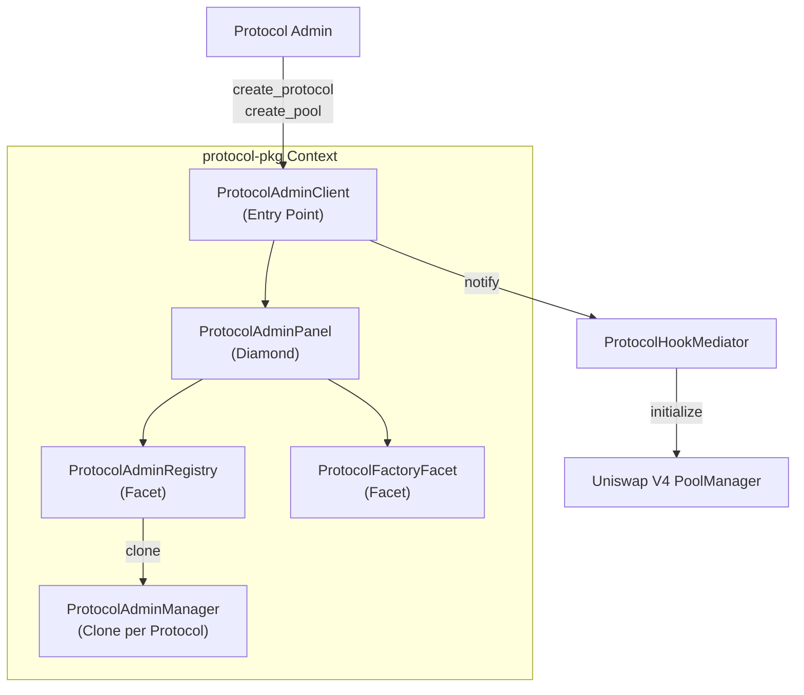
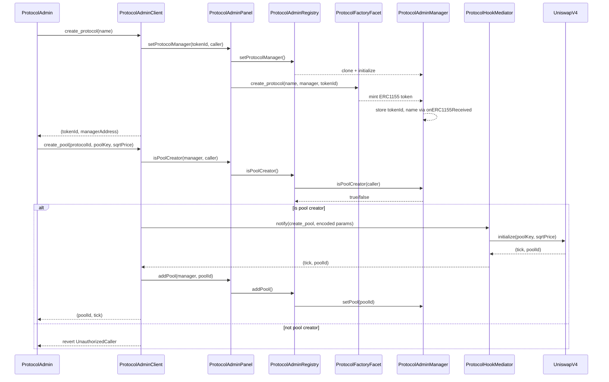
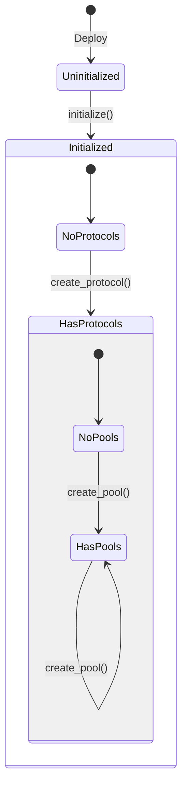
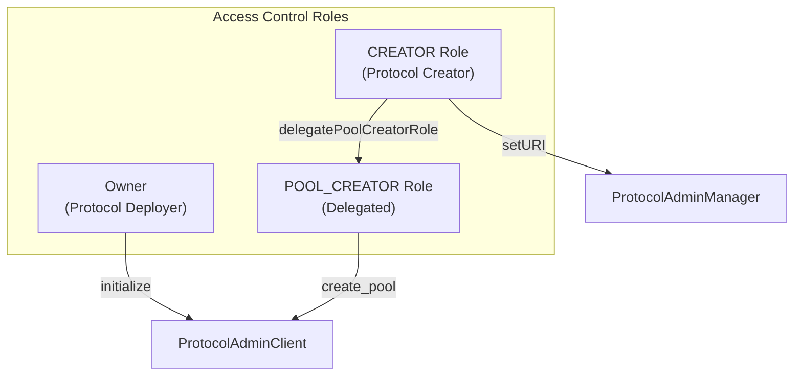

# protocol-pkg: Solution Specification

## Problem Description

Protocol designers require permissioned interfaces to:
- Create and manage Uniswap V4 pool configurations
- Delegate pool creation authority to team members
- Track protocol revenue and pool metrics
- Maintain protocol metadata and identity

Without standardized tooling, each protocol must build custom administration infrastructure.

## Solution Overview

The `protocol-pkg` provides a hierarchical administration system using the Diamond pattern:



## Component Responsibilities

| Contract | Source | Responsibility |
|----------|--------|----------------|
| `ProtocolAdminClient` | [src/protocol-pkg/ProtocolAdminClient.sol](../../contracts/src/protocol-pkg/ProtocolAdminClient.sol) | Entry point for protocol and pool creation |
| `ProtocolAdminPanel` | [src/protocol-pkg/ProtocolAdminPanel.sol](../../contracts/src/protocol-pkg/ProtocolAdminPanel.sol) | Diamond container for facets |
| `ProtocolAdminRegistry` | [src/protocol-pkg/ProtocolAdminRegistry.sol](../../contracts/src/protocol-pkg/ProtocolAdminRegistry.sol) | Protocol-to-manager mapping, pool tracking |
| `ProtocolFactoryFacet` | [src/protocol-pkg/ProtocolFactoryFacet.sol](../../contracts/src/protocol-pkg/ProtocolFactoryFacet.sol) | ERC1155 protocol token minting |
| `ProtocolAdminManager` | [src/protocol-pkg/ProtocolAdminManager.sol](../../contracts/src/protocol-pkg/ProtocolAdminManager.sol) | Per-protocol access control and pool storage |

## Workflow Activity Diagram



## State Transition Diagram



## Access Control Model



## Data Structures

```solidity
// ProtocolAdminManager storage
struct ProtocolAdminManagerStorage {
    address adminPanel;
    bool isClone;
    uint256 tokenId;
    string name;
    mapping(URI_TYPE => string) uris;
    PoolId[] pools;
}

enum URI_TYPE {
    ZORA,
    WEBSITE,
    X,
    FARCASTER
}
```

## Integration Points

| Integration | Direction | Purpose |
|-------------|-----------|---------|
| ProtocolHookMediator | Outbound | Pool initialization via Uniswap V4 |
| Uniswap V4 PoolManager | Indirect | Pool state management |
| ERC1155 Token | Ownership | Protocol identity and transferability |
